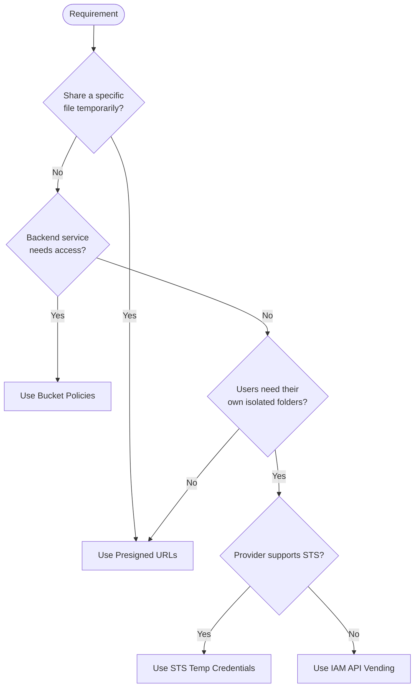
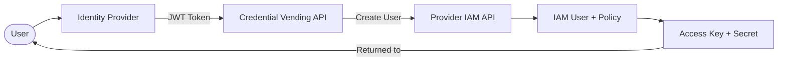

# S3 Access Mechanisms for User File Access

This document describes different mechanisms for granting users access to specific files in S3-compatible object storage.

## Background: What is S3 and Object Storage?

### Object Storage

Traditional file systems (like a computer's hard drive) organize files in folders and subfolders. **Object storage** takes a different approach: it stores files as independent "objects" in a flat structure, each identified by a unique key (similar to a web address).

A useful analogy is a massive warehouse where every item has a unique barcode. Instead of navigating through rooms and shelves (folders), the system retrieves items directly by their barcode (object key).

### What is S3?

**S3** (Simple Storage Service) is Amazon's object storage service, launched in 2006. It became so widely adopted that "S3" and "S3-compatible" have become industry standards. Many cloud providers (Wasabi, Backblaze, MinIO, Exoscale, and others) offer storage services that speak the same "language" (API) as Amazon S3, allowing applications to switch providers with minimal code changes.

### Key Terminology

| Term | Definition |
|------|------------|
| **Bucket** | A container for objects, similar to a top-level folder. Each bucket has a globally unique name. |
| **Object** | A file stored in a bucket, consisting of data, metadata, and a unique key. |
| **Key** | The unique identifier for an object within a bucket (e.g., `users/alice/profile.jpg`). Keys can contain slashes to simulate folder structures. |
| **Prefix** | A partial key used to group related objects (e.g., `users/alice/` matches all of Alice's files). |
| **Credentials** | The access key ID and secret access key used to authenticate requests. |
| **IAM** | Identity and Access Management - the system for managing users, groups, and their permissions. |
| **STS** | Security Token Service - a service that issues temporary, limited-privilege credentials. |

### Why Access Control Matters

By default, objects in S3 are private - only the bucket owner can access them. In real-world applications, common requirements include:

- Allowing users to download files without exposing the owner's credentials
- Letting users upload files directly to storage (bypassing the application server)
- Give different users access to different subsets of files
- Grant temporary access that automatically expires
- Enable other services or applications to access specific resources

The mechanisms described below solve these problems in different ways, each with its own trade-offs between security, flexibility, and complexity.

### Choosing an Access Mechanism: Quick Guide



**Sharing a file with someone:**
Use **Presigned URLs**. Generate a time-limited link that anyone can use to download (or upload) a specific file.

**Backend service needs storage access:**
Use **Bucket Policies**. Define rules that allow the service's credentials to access specific resources.

**Users need access to their own folder:**
Use **STS Temporary Credentials** (if supported) or **IAM API Credential Vending**. These create isolated, per-user access to specific prefixes.

**Simplest possible solution:**
Use **Presigned URLs**. They work everywhere and require no credential distribution to end users.

## Overview

| Mechanism | Scope | Duration | Provider Support | Use Case |
|-----------|-------|----------|------------------|----------|
| Presigned URLs | Single object | Minutes to hours | Universal | Public sharing, direct browser downloads |
| Bucket Policy | Bucket/prefix | Permanent | Most providers | Service accounts, cross-account access |
| ACL | Object/bucket | Permanent | Most providers | Legacy per-object permissions |
| STS Credentials | Prefix-scoped | Minutes to hours | AWS, some S3-compatible | Multi-tenant apps, credential vending |
| IAM API | User-scoped | Until revoked | AWS, Wasabi | Programmatic user management |

## 1. Presigned URLs

A presigned URL is like a temporary guest pass to a specific file. The server generates a special link that works for a limited time, and anyone with that link can access the file - no login required.

Technically, presigned URLs are time-limited URLs that grant temporary access to a specific object without requiring credentials from the requester.

### How it works

1. Server generates a URL containing a cryptographic signature
2. Signature encodes: object key, expiration time, permissions
3. Anyone with the URL can access the object until expiration
4. No authentication required from the client

### Presigned GET

```python
url = s3_client.generate_presigned_url(
    'get_object',
    Params={'Bucket': 'my-bucket', 'Key': 'path/to/file.pdf'},
    ExpiresIn=3600  # 1 hour
)
```

### Presigned PUT

```python
url = s3_client.generate_presigned_url(
    'put_object',
    Params={'Bucket': 'my-bucket', 'Key': 'uploads/user-file.pdf'},
    ExpiresIn=3600
)
```

### Characteristics

- **Pros**: No credential distribution, works with any HTTP client, universal provider support
- **Cons**: URL can be shared/leaked, no user identity tracking, single object per URL
- **Typical expiry**: 15 minutes to 7 days (provider-dependent maximum)

## 2. Bucket Policies

A bucket policy is like a rule book attached to a storage container. It defines who can do what, and under which conditions. For example: "User X can read any file starting with `reports/`" or "Only requests from IP address Y are allowed."

Technically, bucket policies are JSON-based rules attached to buckets that define access based on principals (who), actions (what they can do), resources (which files), and conditions (under what circumstances).

### How it works

1. Policy is attached to the bucket (not individual objects)
2. Evaluated on every request to the bucket
3. Can grant/deny based on: IAM user, IP address, prefix, request headers
4. Supports complex conditions (time-based, referer, VPC endpoint)

### Example: Prefix-based access

```json
{
  "Version": "2012-10-17",
  "Statement": [{
    "Effect": "Allow",
    "Principal": {"AWS": "arn:aws:iam::123456789:user/app-user"},
    "Action": ["s3:GetObject", "s3:PutObject"],
    "Resource": "arn:aws:s3:::my-bucket/users/user-123/*"
  }]
}
```

### Characteristics

- **Pros**: Fine-grained control, prefix scoping, condition-based rules
- **Cons**: Requires IAM principal, policy size limits, no per-request expiry
- **Use case**: Service-to-service access, multi-tenant prefix isolation

## 3. Access Control Lists (ACL)

ACLs are like simple permission tags you can attach to individual files or buckets. They answer basic questions like "Is this file public?" or "Can authenticated users read this?" ACLs are an older approach and have largely been replaced by bucket policies for new projects.

Technically, ACLs are a legacy mechanism for granting permissions to predefined groups or specific accounts.

### How it works

1. Each object/bucket has an ACL
2. ACL contains grants to: owner, authenticated users, all users, specific accounts
3. Predefined "canned ACLs" for common patterns

### Canned ACLs

| ACL | Effect |
|-----|--------|
| `private` | Owner-only access (default) |
| `public-read` | Anyone can read |
| `public-read-write` | Anyone can read/write |
| `authenticated-read` | Any authenticated AWS user can read |

### Characteristics

- **Pros**: Simple, per-object granularity
- **Cons**: Limited expressiveness, no prefix support, deprecated by AWS
- **Status**: AWS recommends bucket policies instead; ACLs disabled by default on new buckets

## 4. STS Temporary Credentials

STS is like a vending machine for temporary access badges. An application requests a badge with specific permissions (e.g., "can access files in Alice's folder for 1 hour"), and STS issues temporary credentials that automatically stop working after the time limit. This is useful for giving users direct access to storage without sharing the main credentials.

Technically, Security Token Service (STS) issues short-lived credentials scoped to specific permissions.

### How it works

1. Application calls STS with a policy defining allowed actions
2. STS returns temporary access key, secret key, and session token
3. Client uses these credentials for S3 API calls
4. Credentials expire automatically

### GetFederationToken (prefix-scoped)

```python
sts_client = boto3.client('sts')
response = sts_client.get_federation_token(
    Name='user-123',
    Policy=json.dumps({
        "Version": "2012-10-17",
        "Statement": [{
            "Effect": "Allow",
            "Action": ["s3:GetObject", "s3:PutObject"],
            "Resource": "arn:aws:s3:::my-bucket/users/user-123/*"
        }]
    }),
    DurationSeconds=3600
)
credentials = response['Credentials']
# Returns: AccessKeyId, SecretAccessKey, SessionToken, Expiration
```

### AssumeRole

```python
response = sts_client.assume_role(
    RoleArn='arn:aws:iam::123456789:role/S3AccessRole',
    RoleSessionName='user-session',
    DurationSeconds=3600
)
```

### Characteristics

- **Pros**: Prefix isolation, automatic expiry, full S3 API access, audit trail
- **Cons**: Limited provider support (AWS, some S3-compatible), requires STS endpoint
- **Provider support**: AWS (full), Wasabi (no), Exoscale (no), MinIO (yes)

## 5. IAM API Credential Vending

When a provider does not support STS (temporary credentials), it is possible to build a custom "credential vending machine." The application creates actual user accounts on-demand through the provider's API, assigns them limited permissions, and hands out those credentials. This approach is more complex than STS but works on providers that lack temporary credential support.

For providers without STS, a credential vending service can create/manage IAM users programmatically.

### How it works

1. User authenticates with identity provider (e.g., Keycloak, OAuth)
2. Credential vending service validates identity
3. Service creates/updates IAM user via provider's IAM API
4. Service attaches policy restricting access to user's prefix
5. Service returns IAM credentials to user

### Architecture



### Provider-specific IAM APIs

| Provider | IAM API Type | Endpoint |
|----------|--------------|----------|
| AWS | AWS-compatible | `iam.amazonaws.com` |
| Wasabi | AWS-compatible | `iam.wasabisys.com` |
| Exoscale | Proprietary REST | `api-{zone}.exoscale.com/v2` |
| MinIO | AWS-compatible | Same as S3 endpoint |

### Characteristics

- **Pros**: Works without STS, full credential lifecycle control
- **Cons**: Requires admin credentials, credentials are long-lived, more complex
- **Use case**: Multi-tenant applications on providers without STS

## Comparison for Multi-Tenant Applications

| Requirement | Presigned URLs | Bucket Policy | STS | IAM Vending |
|-------------|----------------|---------------|-----|-------------|
| Per-user prefix isolation | No | Yes | Yes | Yes |
| No credential distribution | Yes | No | No | No |
| Automatic expiry | Yes | No | Yes | No |
| Full S3 API access | No | Yes | Yes | Yes |
| Works on all providers | Yes | Mostly | No | Varies |
| Audit trail per user | No | Yes | Yes | Yes |

## Feature Matrix Interpretation

The `s3bench features` command tests for AWS-compatible API support:

- **Yes** = AWS-compatible API supported (works with boto3/AWS SDK)
- **No** = AWS-compatible API not supported (vendor-specific alternative may exist)

### Vendor-Specific Alternatives

| Provider | Feature | AWS-compatible | Vendor Alternative |
|----------|---------|----------------|-------------------|
| AWS | IAM API | Yes | - |
| AWS | STS | Yes | - |
| Wasabi | IAM API | Yes | - |
| Wasabi | STS | No | IAM API credential vending |
| Azure | IAM API | No | RBAC / Entra ID |
| Azure | STS | No | SAS tokens |
| Azure | Bucket Policy | No | RBAC / SAS |
| Azure | ACL | No | RBAC |
| Exoscale | IAM API | No | Exoscale API v2 |
| Exoscale | STS | No | Exoscale API v2 |
| Impossible Cloud | IAM API | Yes | - |
| Intercolo | IAM API | No | Unknown |
| Intercolo | STS | No | Unknown |
| MinIO | IAM API | Yes | - |
| MinIO | STS | Yes | - |

When a feature shows "No", check if the provider offers a proprietary API that achieves the same goal. The implementation will differ, but the capability may still exist.

## Recommendations

1. **Simple file sharing**: Use presigned URLs
2. **Service-to-service**: Use bucket policies with IAM principals
3. **Multi-tenant with AWS**: Use STS with prefix-scoped policies
4. **Multi-tenant with Wasabi**: Use IAM API credential vending
5. **Multi-tenant with Exoscale**: Use native Exoscale API or presigned URLs
6. **Multi-tenant with Azure**: Use SAS tokens with Entra ID integration
